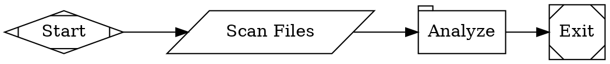

A workflow is a directed graph that defines a repeatable process for AI agents, shell commands, and human decisions. Unlike a DAG (directed acyclic graph), an Arc workflow can and often does include loops — for example, implement-test-fix cycles that repeat until tests pass. You write workflows in [Graphviz DOT](/reference/dot-language), check them into version control, and run them with `arc run start`.

## Anatomy of a workflow

Every workflow is a `digraph` with a `goal`, a `start` node, an `exit` node, and one or more processing nodes connected by edges:

<Frame>
  
</Frame>



The `goal` attribute describes what the workflow accomplishes. Arc uses it to guide agent behavior and generate retrospectives.

## Key node types

Each node's Graphviz **shape** determines how it executes. The three most important types are:

**Agents** (default `box` shape) run an LLM with access to tools — bash, file editing, sub-agents — looping autonomously until the task is complete:

```graphviz
implement [label="Implement", prompt="Read plan.md and implement every step."]
```

**Commands** (`parallelogram`) run shell scripts and capture output for downstream nodes:

```graphviz
validate [label="Run Tests", shape=parallelogram, script="cargo test 2>&1 || true"]
```

**Human gates** (`hexagon`) pause the workflow and wait for a person to choose a path. Edge labels define the options:

```graphviz
approve [shape=hexagon, label="Approve Plan"]

approve -> implement [label="[A] Approve"]
approve -> plan      [label="[R] Revise"]
```

Arc supports additional node types for one-shot prompts, conditional branching, parallel fan-out/fan-in, and more. See [Stages and Nodes](/workflows/stages-and-nodes) for the full reference.

## Branching and loops

<Frame>
  
</Frame>

Edges can have **conditions** that route execution based on outcomes:

```graphviz
gate [shape=diamond, label="Tests passing?"]

gate -> exit      [label="Pass", condition="outcome=success"]
gate -> implement [label="Fix"]
```

Loops are natural — just point an edge back to an earlier node. Use `max_visits` on a node to prevent infinite loops:

```graphviz
fix [label="Fix Failures", prompt="Fix the failing tests.", max_visits=3]
```

## Parallel execution

<Frame>
  
</Frame>

Fan out to run branches concurrently, then merge the results:

```graphviz
fork [label="Fan Out", shape=component]
merge [label="Merge", shape=tripleoctagon]

fork -> security
fork -> architecture
fork -> quality
security    -> merge
architecture -> merge
quality     -> merge
merge -> report -> exit
```

## Goal gates

Mark critical nodes with `goal_gate=true`. The workflow fails if any goal gate doesn't succeed — even if execution reaches the exit node:

```graphviz
validate [label="Validate", prompt="Run the test suite and verify all tests pass.", goal_gate=true]
```

## Running a workflow

From the CLI:

```bash
arc run start workflow.dot
```

Or from a [run config TOML](/execution/run-configuration) for repeatable, parameterized runs:

```bash
arc run start run.toml
```

See the [Quick Start](/getting-started/quick-start) to try it out, or browse the [example workflows](/examples/implement-feature) for real-world patterns.
