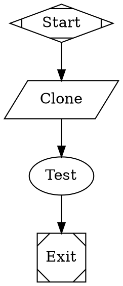

Arc supports `$variable` placeholders that let you parameterize workflows without editing the DOT file.

## Run config variables

Define variables in the `[vars]` section of a run config TOML file:

```toml
version = 1
goal = "Run tests for $repo_name"
graph = "check.dot"

[vars]
repo_name = "arc"
repo_url = "https://github.com/qltysh/arc"
language = "rust"
```

These variables are expanded into the DOT source **before** the graph is parsed. You can use `$variable` anywhere in the DOT file — goals, prompts, labels, scripts, or any other attribute:



When launched with `arc run start run.toml`, Arc replaces `$repo_name`, `$repo_url`, and `$language` with their values before parsing the graph.

### Undefined variables

If a `$variable` in the DOT file has no matching entry in `[vars]`, Arc raises an error. This catches typos early — a misspelled `$langauge` fails immediately rather than passing a literal `$langauge` to the LLM.

A bare `$` not followed by an identifier character (e.g. `costs $5`) is left as-is.

## The `$goal` variable

Inside agent and prompt node prompts, Arc automatically expands `$goal` to the workflow's `goal` attribute. This happens at runtime, after graph parsing:


The plan node's prompt becomes `"Create a plan for: Implement the login feature"`.

## Variable merging

When using server-level run defaults alongside a run config TOML, variables are merged. Task config vars override default vars when keys collide:

| Source | Priority |
|---|---|
| Run config TOML `[vars]` | Highest — wins on collision |
| Server defaults `[vars]` | Lowest — provides fallback values |
